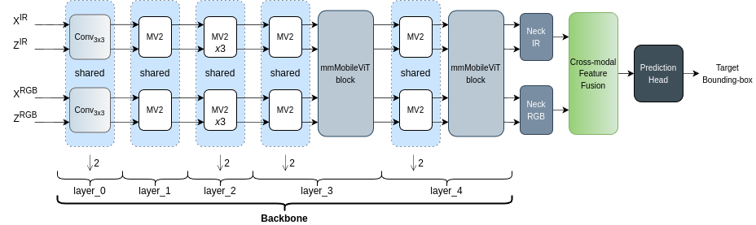
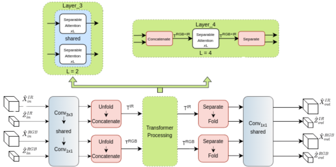
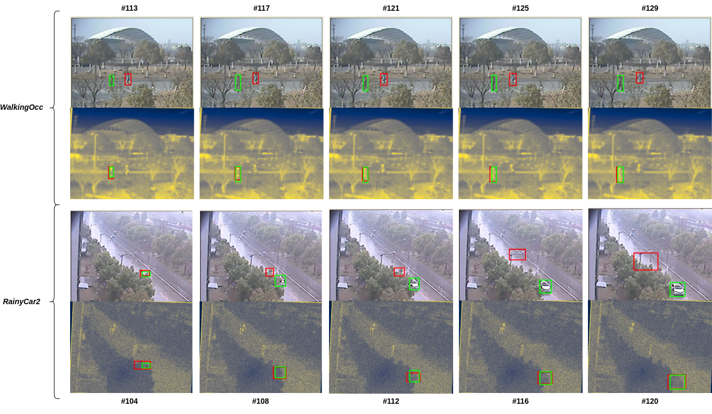
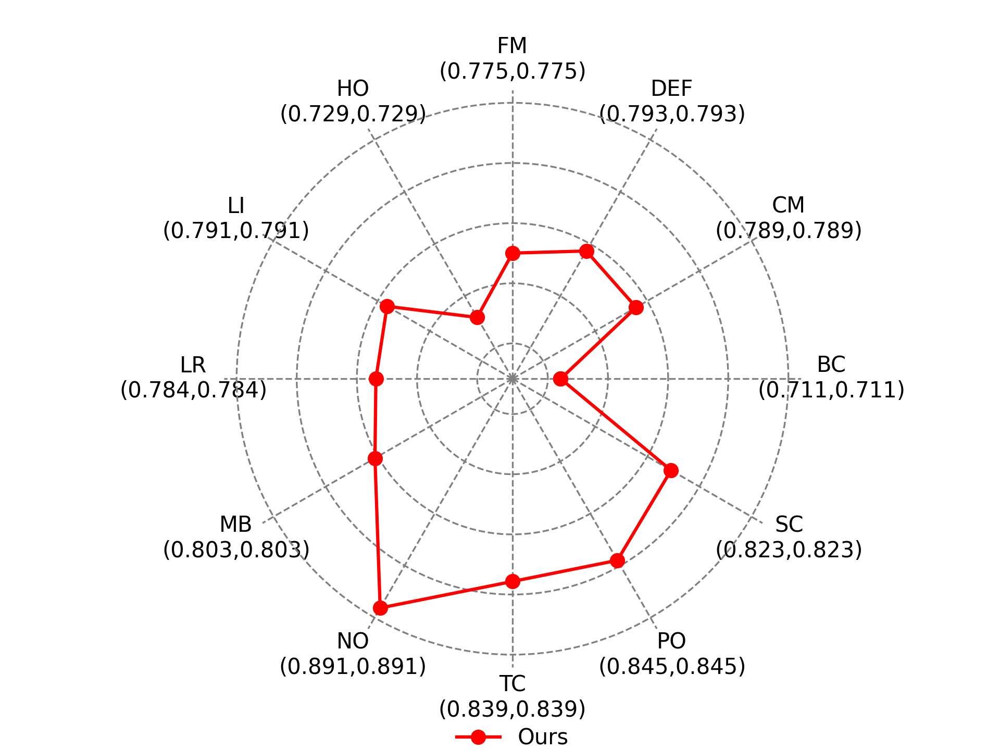
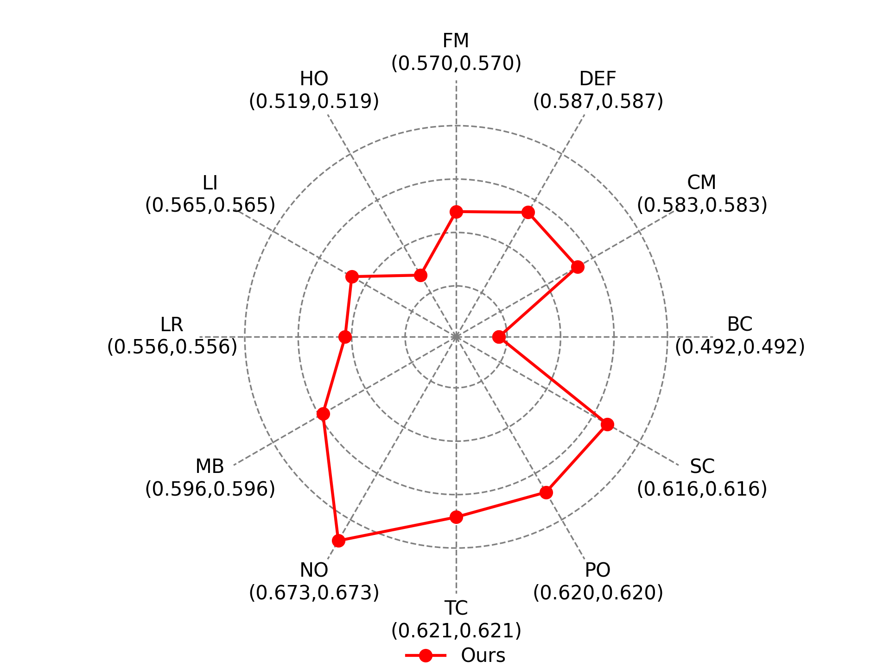

# [Lightweight RGB-T Tracking with Mobile Vision Transformers](https://www.arxiv.org/abs/2506.19154) [ICASSP2026] 
# Official implementation

**Mahdi Falaki, Maria A. Amer**  
Department of Electrical and Computer Engineering, Concordia University, Montréal, Québec, Canada  

---

## Highlights

<table align="center">
  <tr>
    <td bgcolor="white" style="padding:12px; border-radius:8px;">
      
    </td>
  </tr>
</table>
<p align="center"><i>Figure: The pipeline of proposed RGB-T tracker.</i></p>

<p align="center">
  
</p>
<p align="center"><i>Figure: Architecture of the proposed mmMobileViT block.</i></p>

<p align="center">
  
</p>
<p align="center"><i>Figure: RGB Tracking vs. RGB-T Tracking. </i></p>

*Table: Comparison on LasHeR, RGBT234, and GTOT.*

| Tracker | #Params (M) | MACs (G) | FPS (GPU) | LasHeR PR | LasHeR SR | LasHeR NPR | RGBT234 MPR | RGBT234 MSR | GTOT PR | GTOT SR |
|---|---:|---:|---:|---:|---:|---:|---:|---:|---:|---:|
| SUTrack Tiny | 22 | 3 | 100 | 0.667 | 0.539 | – | 0.859 | 0.638 | 0.853 | 0.726 |
| EMTrack | 16 | 2 | 83.8 | 0.659 | 0.533 | – | 0.838 | 0.601 | – | – |
| CMD | 19.9 | – | 30 | 0.590 | 0.464 | 0.546 | 0.824 | 0.584 | 0.892 | 0.734 |
| TBSI Tiny | 14.9 | – | 40 | 0.617 | 0.489 | 0.578 | 0.794 | 0.555 | 0.881 | 0.706 |
| **Ours** | **3.93** | **4.35** | **121.9** | 0.603 | 0.473 | 0.567 | 0.806 | 0.589 | 0.895 | 0.7467 |
| SMAT* (RGB-only) | 3.76 | – | 154.6 | 0.549 | 0.438 | 0.512 | 0.737 | 0.536 | 0.690 | 0.578 |

---

## Installation

## Environment Setup (Conda)

Create the environment from `environment.yml`.
```bash
conda env create -f environment.yml
conda activate mobilevit-track
```

Generate the relevant files:
```bash
python tracking/create_default_local_file.py --workspace_dir . --data_dir ./data --save_dir ./output
```

After running this command, modify the dataset paths by editing this file:
```text
lib/train/admin/local.py          # paths about training
```

## Training

* Set the path of training datasets in `lib/train/admin/local.py`
* Download the pretrained MobileViTv2 backbone weights from [MobileViTv2 weights](https://huggingface.co/apple/mobilevitv2-1.0-imagenet1k-256) and place it under the `pretrained_models/` folder.
* For data preparation, please refer to [this](https://github.com/jiawen-zhu/ViPT)
* Uncomment lines `67-68, 74-75, and 81-82`, and change line `85` to `x_v, z_v, x_i, z_i = self._forward_MobileViT_layer(self.layer_3, x_v, z_v, x_i, z_i)` in the [base_backbone.py](https://github.com/MahdiFalaki/Lightweight-RGB-T-object-tracker-using-Mobile-Vision-Transfomers/blob/main/lib/models/mmMobileViT_Track/base_backbone.py) file. 
* Run
```bash
python tracking/train.py --script mmMobileViT_Track --config mobilevitv2_256_128x1_LasHeR_60ep --save_dir ./output --mode single
```
* The saved checkpoints and training logs will be saved under `output/` folder.

## Pretrained tracker model
Pretrained model weights can be downloaded from [Drive Link](https://drive.google.com/file/d/1mMlugWT31Bc0bx-Z_2gljVldpoQBjp9_/view?usp=drive_link).

## Tracker Evaluation

* Update the <DATASET_PATH> and <SAVE_PATH> in [test_rgbt_mgpus.py](https://github.com/MahdiFalaki/Lightweight-RGB-T-object-tracker-using-Mobile-Vision-Transfomers/blob/main/RGBT_workspace/test_rgbt_mgpus.py).
* Download, place the pretrained tracker model zip file under the `models/` folder, and unzip it.
* Run
```bash
python tracking/test.py --tracker_name mmMobileViT_Track --tracker_param mobilevitv2_256_128x1_LasHeR_60ep --dataset RGBT234
```

* Change the `DEVICE` variable between `cuda` and `cpu` in the `lib/config/mmMobileViT_Track/config.py` file for GPU and CPU-based inference, respectively.
* The raw results will be stored under `RGBT_workspace/results/` folder.
* Change `--dataset RGBT234` to `LasHeR` and `GTOT` for testing on LasHeR and GTOT, respectively.
* Use raw results to evaluate with ground truth data.

---

## Attribute-based analysis (RGBT234)

  
*MPR attribute-wise analysis on RGBT234.*

  
*MSR attribute-wise analysis on RGBT234.*

**Attributes (RGBT234):**  
NO (No Occlusion), PO (Partial Occlusion), HO (Hyaline Occlusion), LI (Low Illumination), LR (Low Resolution), TC (Thermal Crossover), DEF (Deformation), FM (Fast Motion), SV (Scale Variation), MB (Motion Blur), CM (Camera Moving), BC (Background Clutter).

Across both radar plots, excluding NO (No Occlusion), where performance is highest, the tracker is most robust under PO (Partial Occlusion) and TC (Thermal Crossover), and it also performs strongly under SV/SC (Scale Variation). In contrast, it is most vulnerable to BC (Background Clutter) and HO (Hyaline Occlusion), with additional degradation under LR (Low Resolution) and FM (Fast Motion).

---

## Acknowledgements
* We use the Separable Self-Attention Transformer implementation and the pretrained `MobileViTv2` backbone from [ml-cvnets](https://github.com/apple/ml-cvnets). 
* Our training code is built upon [SMAT](https://github.com/goutamyg/SMAT/tree/main) and [ViPT](https://github.com/jiawen-zhu/ViPT), thanks!
* To generate the evaluation metrics for different datasets, we refer you to [LasHeR Toolkit](https://github.com/BUGPLEASEOUT/LasHeR) for LasHeR evaluation, to [MPR_MSR_Evaluation](https://sites.google.com/view/ahutracking001/) for RGBT234 evaluation, and to [GTOT-Toolkit](https://github.com/xuboyue1999/RGBT-Tracking/tree/main/GTOT-toolkit) for GTOT.
---

## Citation

You're welcome to use the work for your research. Please consider citing:

```bibtex
@inproceedings{falaki2025lightweightrgbttrackingmobile,
  title     = {Lightweight RGB-T Tracking with Mobile Vision Transformers},
  author    = {Falaki, Mahdi and Amer, Maria A.},
  booktitle = {IEEE International Conference on Acoustics, Speech and Signal Processing (ICASSP)},
  year      = {2026},
  note      = {Accepted}
}
```
